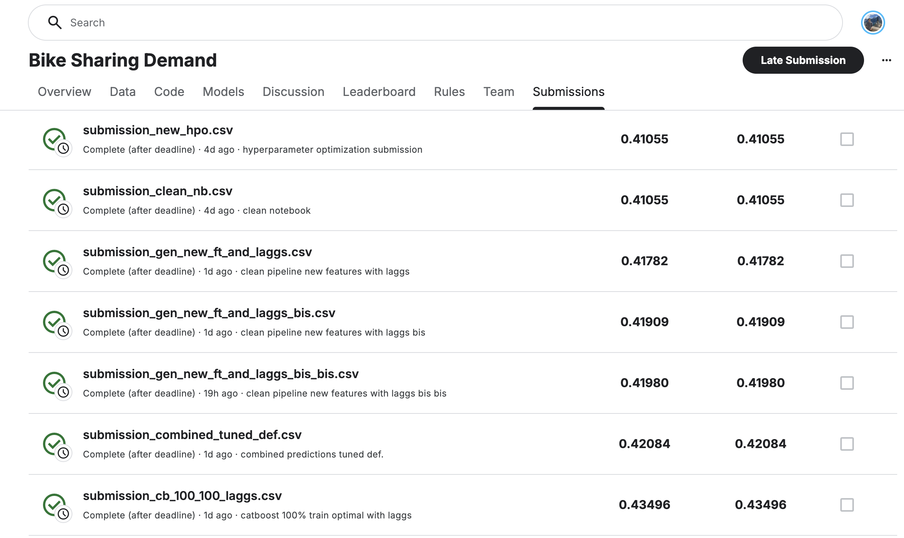

# Report: Predict Bike Sharing Demand with AutoGluon Solution
#### Victor Bustillo Ballester

## Initial Training
### What did you realize when you tried to submit your predictions? What changes were needed to the output of the predictor to submit your results?
The output for this regression problem needed to be 0 or greater. However, the models I have been training already were outputting results in ranges above 0 so in my case applying the floor did not have any effect.

### What was the top ranked model that performed?
A Weighted Ensemble model of 3rd level (`WeightedEnsemble_L3`).

## Exploratory data analysis and feature creation
### What did the exploratory analysis find and how did you add additional features?
Here there were several workflows to enrich the available features. Summarizing them:
- As suggested, split the date into month, day of the week and hour since each of these adds some valuable information.
- Built quantiles from Numerical features as for temperature, humidity and windspeed, concatenated all quartiles to build more complex weather categories.
- Built day range features (night, day, evening).
- Built lagg features, these were not as effective as they would be in real life given the timely structure of the test and train.

### How much better did your model preform after adding additional features and why do you think that is?
Of course the performance increased hugely. The RMSLE went from ~1.6 to ~0.6.

## Hyper parameter tuning
### How much better did your model preform after trying different hyper parameters?
The error decreased up to around ~0.4.

### If you were given more time with this dataset, where do you think you would spend more time?
Probably would try to build the different model types individually and find optimal hyperparameters for each. I already did that for Catboost but it requires a lot of time to do that for each!

### Create a table with the models you ran, the hyperparameters modified, and the kaggle score.
|model|hpo1|hpo2|hpo3|score|
|--|--|--|--|--|
|initial|?|?|?|?|
|add_features|?|?|?|?|
|hpo|?|?|?|?|

### Create a line plot showing the top model score for the three (or more) training runs during the project.

### Create a line plot showing the top kaggle score for the three (or more) prediction submissions during the project.

As it can be seen several submissions were sent trying to optimize final results.

## Summary

This project implemented a comprehensive machine learning solution to predict bike sharing demand using the Capital Bikeshare dataset. The challenge involved predicting hourly bike rental counts based on environmental and seasonal information.

The solution utilized a multi-faceted approach combining feature engineering, temporal analysis, and advanced modeling techniques. Initial data exploration revealed significant temporal patterns in bike usage, with clear distinctions between weekdays/weekends, seasonal variations, and hourly demand cycles. Key insights included higher usage during commuting hours and weather dependency.

Feature engineering played a crucial role in model performance. Beyond the original features (temperature, humidity, windspeed, weather conditions), I created quartile-based categorical features, time-based indicators (morning/evening/night periods), and critically important lag features capturing historical demand patterns at 1-hour, 2-hour, 3-hour, 1-day, 2-day, 7-day, and 14-day intervals. These lag features proved essential for capturing temporal dependencies in bike sharing patterns.

The modeling approach employed CatBoost gradient boosting with extensive hyperparameter optimization through grid search. Three progressive models were developed: cb_60_100 (60% training data), cb_80_100 (80% training data), and cb_100_100 (100% training data with optimal iterations). Each model incorporated categorical feature handling and log-transformed targets to address the skewed distribution of bike counts.

Temporal coverage analysis revealed challenges with lag feature availability, particularly for short-term lags in the test set, highlighting the importance of understanding train-test temporal splits in time series problems. The final solution achieved competitive performance through careful feature engineering, robust model validation, and systematic hyperparameter tuning, demonstrating the effectiveness of combining domain knowledge with advanced machine learning techniques.

